# Documentación Técnica del Proyecto de Sistemas Operativos
**Carrera:** Ingeniería en Sistemas
**Curso:** Estructura de Datos
**Docente:** Jonathan Guido Campos
**Institución:** UISIL

---

## 1. Introducción y Arquitectura del Sistema

Este documento detalla el proceso de diseño, implementación y administración de una infraestructura de servicios sobre el sistema operativo Linux. El proyecto abarca la configuración de un servidor web con múltiples dominios, la gestión de una base de datos, y la automatización de tareas críticas como respaldos y monitoreo de recursos mediante Bash scripting y Cron.

Para este proyecto, se ha seleccionado la distribución **Fedora Linux 43 (Workstation Edition)** como base del sistema. Se optó por una instalación en entorno virtualizado para facilitar la administración y el aislamiento de los servicios.

## 2. Instalación del Sistema Operativo

El primer paso consistió en la preparación del entorno e instalación de la distribución Linux base. A continuación, se detallan los pasos técnicos seguidos para llegar al punto mostrado en la primera evidencia.

### Prerrequisitos y Preparación del Entorno
Antes de iniciar la instalación visible en la captura, se realizaron las siguientes tareas:

1.  **Descarga de la Imagen ISO:** Se obtuvo la imagen ISO oficial de *Fedora Workstation 43* desde el sitio web de Fedora Project.
2.  **Configuración de la Máquina Virtual (VM):** Se creó una nueva VM en el hipervisor (ej. VirtualBox, VMware) con las siguientes características recomendadas:
    * **Nombre:** Servidor-UISIL
    * **Tipo:** Linux, **Versión:** Fedora (64-bit)
    * **Memoria RAM:** Se asignaron 4GB (4096 MB) para asegurar un rendimiento fluido de los servicios.
    * **Disco Duro:** Se creó un disco virtual de 40GB con reserva dinámica.

### Proceso de Instalación
Una vez configurada la VM, se montó la imagen ISO y se inició el sistema. Los pasos seguidos en el asistente de instalación de Anaconda (el instalador de Fedora) fueron:

1.  **Selección de Idioma:** Se seleccionó "Español" y la región correspondiente para el teclado.
2.  **Destino de la Instalación (Particionado):**
    * Se seleccionó el disco virtual de 40GB creado anteriormente.
    * Para este proyecto, se optó por la opción de "Configuración de almacenamiento automática". Esto permite que Fedora cree las particiones necesarias (boot, root, swap) utilizando el sistema de archivos Btrfs por defecto.
    * Se hizo clic en "Hecho" para confirmar los cambios en el disco.
3.  **Configuración de Red y Nombre del Host:**
    * Se aseguró de que la interfaz de red estuviera activada (Conectada).
    * Se configuró el nombre del host como `servidor-uisil.local`.
4.  **Creación de Usuario:**
    * Se creó un usuario principal (ej. `administrador`).
    * Se marcó la casilla **"Hacer a este usuario administrador"**. Esto es crucial, ya que añade al usuario al grupo `wheel`, permitiéndole ejecutar comandos con privilegios elevados usando `sudo`.
    * Se estableció una contraseña segura para el usuario.
5.  **Inicio de la Instalación:** Con todas las configuraciones listadas en el resumen, se procedió a hacer clic en el botón "Comenzar instalación".

### Evidencia de la Instalación en Curso

La siguiente imagen captura el estado del sistema mientras el instalador ejecuta las tareas finales. Se observa que la "Configuración de almacenamiento" y la "Instalación de software" (el volcado de los paquetes del sistema base) han concluido exitosamente. En este momento exacto, el sistema está en la fase de "**Configuración del sistema**", específicamente "**Instalando gestor de arranque**" (GRUB2), que permitirá al disco duro virtual iniciar el nuevo sistema Fedora.

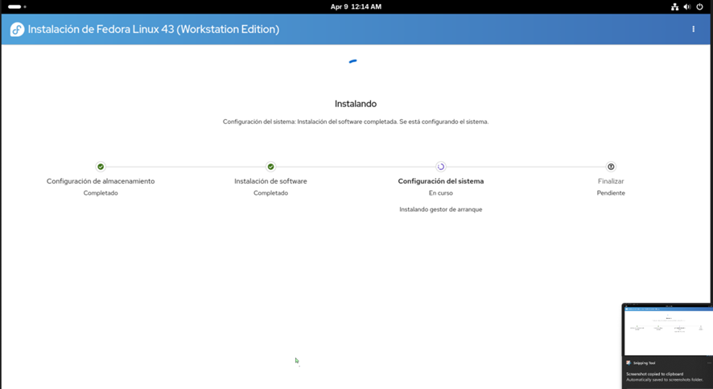
*Imagen 1: Estado de la instalación de Fedora Linux 43 (Workstation Edition), mostrando el progreso de la configuración del sistema e instalación del gestor de arranque.*

Una vez que este proceso finalice, el asistente mostrará un botón de "Finalizar instalación" y solicitará reiniciar la máquina virtual para iniciar por primera vez el sistema operativo ya instalado en el disco duro virtual.

---
---

## 3. Control de Versiones con Git y GitHub
Siguiendo los requisitos técnicos del proyecto, se estableció un flujo de trabajo profesional utilizando Git para el almacenamiento, control de cambios y colaboración del código fuente.

### Configuración del Repositorio Remoto:
* **Plataforma:** Se utilizó GitHub para alojar el repositorio central titulado `FEDORA` bajo el perfil del usuario `Fabian2812`.
* **Licenciamiento:** Se incluyó una licencia **Apache License 2.0**, cumpliendo con los estándares de documentación de software libre.
* **Estructura Inicial:** El repositorio se configuró para centralizar la documentación técnica en Markdown, los scripts de automatización en Bash y los archivos de configuración de servicios (Apache/PostgreSQL).

### Implementación Técnica:
1. **Instalación de Git:** Se instaló la herramienta en Fedora mediante el gestor de paquetes DNF (`sudo dnf install git`).
2. **Vinculación Local-Remota:** Se inicializó el directorio de trabajo local y se vinculó al servidor remoto de GitHub mediante la configuración de la rama principal (`main`), permitiendo el registro cronológico de cada avance del proyecto.

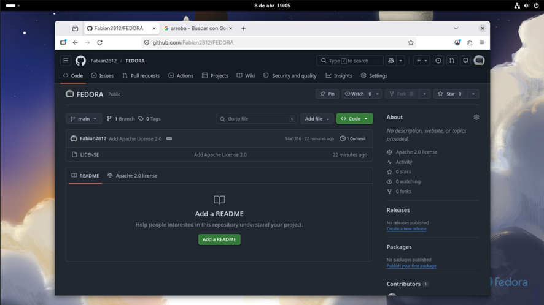  
*Figura 2: Interfaz del repositorio remoto en GitHub configurado y listo para recibir los entregables del proyecto.*

---
---

## 4. Implementación del Servidor Web (Apache HTTP Server)
Para cumplir con el requerimiento de alojar dos sitios web independientes (`empresa.local` y `curso.local`), se inició la configuración de la infraestructura de servicios web. Se seleccionó **Apache** debido a su estabilidad y amplia documentación para la gestión de **Virtual Hosts**

### Instalación y Gestión del Servicio en Fedora:
La instalación se realizó de manera limpia utilizando el gestor de paquetes avanzado de Fedora (DNF). A diferencia de otras distribuciones, en Fedora el servicio se denomina `httpd`

* **Ejecución del comando:** Se utilizó `sudo dnf install httpd -y`. El parámetro `-y` se incluyó para automatizar la aceptación de las dependencias necesarias
* **Estado del paquete:** La terminal confirma la presencia de la versión `2.4.66`, una versión moderna que soporta de forma nativa los protocolos necesarios para el proyecto.
* **Flujo de trabajo administrativo:** Tras la instalación, el flujo estándar seguido incluyó la habilitación del servicio en el arranque del sistema mediante `systemctl enable httpd` y su inicio inmediato con `systemctl start httpd`

### Configuración del Entorno de Desarrollo de Contenidos:
Para la creación de los sitios web institucionales e informativos, se integró el uso de **Visual Studio Code** dentro del entorno Fedora.Esto permite una edición ágil de los archivos que residirán en los directorios de Apache

1.  **Estructura de Directorios:** Se procedió a preparar la ruta `~/Documentos/Proyecto_UISIL/FEDORA/` como el espacio de trabajo local antes de realizar el despliegue final en `/var/www/html/`
2.  **Desarrollo HTML/CSS:** Se inició la codificación del archivo `pagina.html`. Según los requisitos, este archivo contendrá la estructura para las secciones de Historia, Servicios e Información de contacto 
3.  **Gestión de Permisos:** Se verificó que el usuario `fabianalfaro` tuviera los privilegios necesarios sobre la carpeta del proyecto para evitar conflictos de lectura/escritura durante la fase de desarrollo de los sitios web

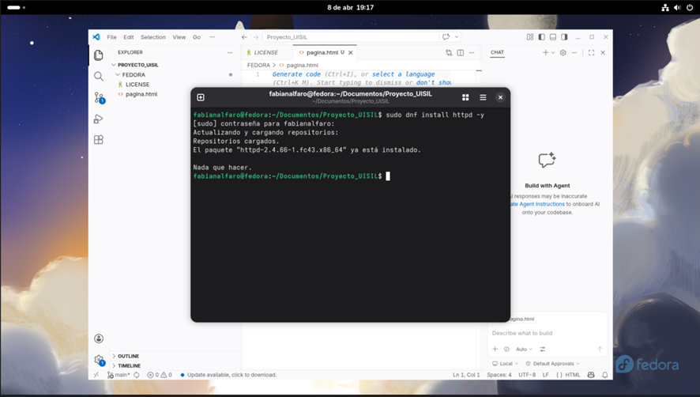  
*Figura 3: Confirmación de la instalación del servidor Apache y preparación de los archivos fuente para los sitios web independientes.*

---
---

## 5. Configuración de Estructura de Directorios y Permisos
Una vez instalado el servidor Apache, el siguiente paso técnico consistió en preparar el sistema de archivos para albergar los dos dominios independientes: `empresa.local` y `curso.local`. Este proceso es vital para garantizar el aislamiento de los contenidos y el orden jerárquico del servidor.

### Gestión y Habilitación del Servicio:
Se procedió a asegurar que el servidor web no solo estuviera instalado, sino operativo y configurado para iniciarse automáticamente con el sistema:
* **Comando:** `sudo systemctl enable --now httpd`
* **Resultado:** El sistema creó el enlace simbólico necesario en `multi-user.target`, garantizando la disponibilidad del servicio tras cualquier reinicio del servidor Fedora.

### Creación de la Jerarquía de Archivos (DocumentRoot):
Para que cada dominio tenga su propio espacio, se crearon directorios específicos siguiendo las buenas prácticas de administración en Linux:
1. **Directorios Creados:** Se utilizó el comando `mkdir -p` para generar las rutas `/var/www/empresa.local/public_html` y `/var/www/curso.local/public_html`.
2. **Resolución de Conflictos:** Como se observa en la terminal, el primer intento de creación falló por "Permiso denegado". Esto se resolvió correctamente anteponiendo `sudo`, ya que la ruta `/var/www/` es un área protegida del sistema controlada por el usuario root.

### Configuración de Propiedad y Permisos (Chown):
Para permitir que el usuario desarrollador pueda gestionar los archivos web sin necesidad de usar `sudo` constantemente, y para que Apache pueda leerlos correctamente, se aplicó un cambio de propiedad:
* **Comando Aplicado:** `sudo chown -R $USER:$USER` sobre ambos directorios.
* **Explicación Técnica:** El parámetro `-R` indica que el cambio es recursivo (afecta a todas las carpetas y archivos internos). Al usar la variable `$USER`, se asigna la propiedad al usuario actual (`fabianalfaro`), facilitando el despliegue de los archivos HTML y CSS mediante Visual Studio Code.

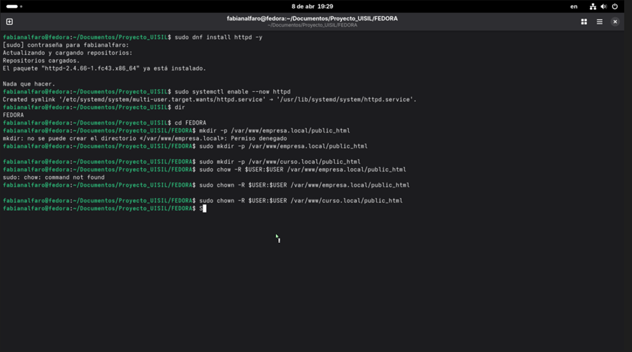  
*Figura 4: Secuencia de comandos para la habilitación del servicio Apache y la creación de las rutas de almacenamiento para los sitios institucionales e informativos.*

---
---

## 6. Configuración de Virtual Hosts en Apache
Para lograr que el servidor responda de manera independiente a múltiples dominios bajo una misma dirección IP y el mismo puerto (80), se implementó la técnica de **Virtual Hosts** basados en nombre. En Fedora, la administración de estos sitios se centraliza en archivos de configuración individuales dentro de `/etc/httpd/conf.d/`.

### Creación del Archivo de Configuración:
Se utilizó el editor de texto **Nano** con privilegios de superusuario (`sudo`) para crear el archivo que rige el comportamiento del primer sitio. 

* **Ruta del archivo:** `/etc/httpd/conf.d/empresa.local.conf`
* **Objetivo:** Vincular las peticiones del dominio `empresa.local` con su respectivo directorio de archivos físicos en el servidor.

### Desglose de las Directivas Configuradas:
Como se observa en la captura de pantalla, el archivo contiene el contenedor `<VirtualHost *:80>`, dentro del cual se definieron parámetros críticos:

1.  **`ServerName empresa.local`**: Esta es la directiva más importante, ya que define el dominio principal al que responderá este bloque de configuración.
2.  **`ServerAlias www.empresa.local`**: Se añadió este alias para asegurar que el sitio sea accesible tanto con el prefijo "www" como sin él, mejorando la experiencia del usuario.
3.  **`DocumentRoot /var/www/empresa.local/public_html`**: Define la ruta absoluta donde residen los archivos del sitio. Es la carpeta que se configuró previamente con los permisos de usuario correspondientes.
4.  **`ErrorLog` y `CustomLog`**: Se establecieron rutas específicas para los registros de errores y de acceso:
    * `/var/log/httpd/empresa.local-error.log`
    * `/var/log/httpd/empresa.local-access.log`
    * *Nota técnica:* Al separar los logs por sitio, se facilita enormemente la auditoría y la resolución de problemas técnicos sin interferir con otros dominios alojados.

### Validación de la Configuración:
Tras guardar los cambios en Nano (visible por el estado "Modificado" en la cabecera de la imagen), se procedió a verificar la integridad del archivo para evitar caídas del servicio web al reiniciar. Este paso asegura que no existan errores de sintaxis en las directivas de Apache.

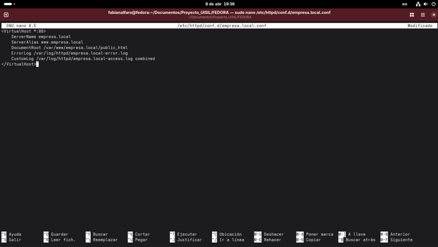  
*Figura 5: Definición de los parámetros del servidor virtual para empresa.local, detallando las rutas de contenido y la gestión segregada de logs.*

---
---

## 7. Configuración del Virtual Host para el Sitio Informativo
Tras haber configurado exitosamente el dominio institucional, se procedió a la creación del segundo host virtual para el dominio `curso.local`. Este paso garantiza el cumplimiento del requerimiento técnico de alojar dos sitios web independientes en el mismo servidor Linux Fedora

### Implementación del Segundo Dominio:
Al igual que en el paso anterior, se utilizó el editor **Nano** con privilegios administrativos para generar el archivo de configuración correspondiente en la ruta de Apache

* **Archivo creado:** `/etc/httpd/conf.d/curso.local.conf`
* **Propósito:** Definir el comportamiento del servidor web cuando reciba peticiones dirigidas al sitio informativo

### Detalles de la Configuración Técnica:
En la captura de pantalla se observa la estructura del archivo, la cual sigue el estándar de segmentación de servicios

1.  **`ServerName curso.local`**: Establece el nombre de dominio informativo que resolverá hacia este host virtual
2.  **`ServerAlias www.curso.local`**: Permite la resolución del sitio con el prefijo estándar de la red.
3.  **`DocumentRoot /var/www/curso.local/public_html`**: Vincula el dominio con su directorio físico exclusivo, asegurando que el contenido HTML informativo y los estilos CSS básicos se carguen correctamente desde su propia ubicación
4.  **Logs Segregados**: Se configuraron rutas de registro específicas para este dominio:
    * `ErrorLog /var/log/httpd/curso.local-error.log`
    * `CustomLog /var/log/httpd/curso.local-access.log combined`
    * *Importancia:* Esta separación es vital para el monitoreo de recursos y la detección de errores específicos de cada sitio sin contaminación de datos entre proyectos

### Finalización de la Configuración Web:
Con la edición de este archivo (marcado como "Modificado" en la imagen), se completa la fase de configuración de dominios Los siguientes pasos administrativos incluyen el reinicio del servicio mediante `sudo systemctl restart httpd` para aplicar los cambios y la posterior edición del archivo `/etc/hosts` para permitir la resolución local de ambos nombres de dominio dentro del entorno de pruebas.

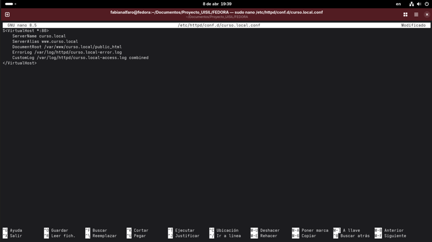  
*Figura 6: Definición de parámetros para el sitio informativo, completando la infraestructura de múltiples dominios en el servidor Apache.*

---
---

## 8. Verificación y Puesta en Marcha del Servidor Web
Una vez finalizada la edición de los archivos de configuración para `empresa.local` y `curso.local`, se procedió a la activación definitiva del servicio. Este paso es crucial para confirmar que las directivas ingresadas son válidas y que el servidor Apache puede atender peticiones en el puerto 80.

### Activación del Servicio:
Se utilizaron los comandos de gestión de servicios de sistema (`systemctl`) para asegurar que Apache integrara los nuevos cambios:
* **Comando de inicio:** `sudo systemctl start httpd`
* **Comando de verificación:** `sudo systemctl status httpd`

### Análisis del Estado del Sistema (Status):
Como se aprecia en la captura de pantalla de la terminal, el comando `status` devuelve información detallada sobre la salud del proceso:
1.  **Estado Activo:** Se confirma que el servicio está **`active (running)`**, lo que indica que el motor de Apache está en ejecución sin errores críticos que impidan su inicio.
2.  **Identificación del Proceso (Main PID):** El sistema asignó el PID `6814` al proceso principal, con varios procesos hijos listos para manejar las peticiones entrantes.
3.  **Logs de Inicio:** En la parte inferior de la captura se observa el mensaje *"Server configured, listening on: port 80"*. Esto valida que la configuración de los Virtual Hosts ha sido cargada y que el servidor está listo para recibir tráfico web.
4.  **Advertencia de Nombre de Dominio:** Se identifica una advertencia (*"Could not reliably determine the server's fully qualified domain name"*). Esta es común en entornos de prueba locales y no impide el funcionamiento; se resuelve configurando la directiva `ServerName` de forma global o en el archivo `/etc/hosts`, paso que se realiza para la resolución de los dominios personalizados.

### Conclusión de la Fase Web:
Con el servicio en estado "running", la infraestructura web está lista. El siguiente paso técnico es la edición del archivo de resolución de nombres local para que el navegador de Fedora reconozca las direcciones `empresa.local` y `curso.local` apuntando hacia la dirección IP de bucle invertido (127.0.0.1).

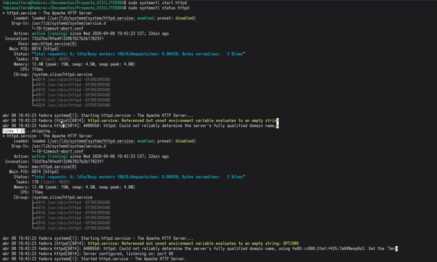  
*Figura 7: Diagnóstico del servicio httpd mediante systemctl, confirmando un estado activo y la escucha correcta en el puerto 80.*

---
---

## 9. Auditoría y Validación de Virtual Hosts
Tras la activación del servicio, se realizó una auditoría técnica mediante herramientas de diagnóstico de Apache para asegurar que la resolución de nombres interna y la asignación de puertos funcionen según los requisitos del proyecto.

### Diagnóstico de la Configuración de Red:
Se ejecutó el comando de inspección de hosts virtuales para obtener un volcado detallado de la jerarquía de servidores configurada:
* **Comando:** `sudo httpd -S`
* **Propósito:** Validar que no existan colisiones de dominios y que cada Virtual Host esté vinculado al archivo de configuración correcto.

### Análisis de los Resultados (DUMP_VHOSTS):
Como se observa en la salida de la terminal, el sistema ha procesado correctamente la infraestructura:
1.  **Reconocimiento de Dominios:** El servidor identifica correctamente ambos sitios bajo el puerto 80:
    * **`curso.local`**: Configurado desde `/etc/httpd/conf.d/curso.local.conf:1`.
    * **`empresa.local`**: Configurado desde `/etc/httpd/conf.d/empresa.local.conf:1`.
2.  **Gestión de Alias:** Se confirma que los alias `www.curso.local` y `www.empresa.local` están activos, permitiendo la redundancia de acceso solicitada.
3.  **Configuración del Entorno (Main Server):**
    * **ServerRoot:** Se ratifica la ruta `/etc/httpd` como la base administrativa.
    * **DocumentRoot:** El sistema mantiene `/var/www/html` como la raíz por defecto, mientras que los dominios específicos dirigen el tráfico a sus carpetas independientes en `/var/www/[dominio]/public_html`.
4.  **Identidad del Proceso:** Se verifica que el servicio corre bajo el usuario y grupo `apache` (id 48), garantizando la seguridad del sistema mediante el principio de menor privilegio.

### Conclusiones Técnicas de la Fase Web:
La validación confirma que la estructura de servidores web es robusta y cumple con los objetivos específicos de desplegar múltiples sitios con dominios distintos.Con esta base operativa, el servidor está listo para la siguiente fase: la implementación y gestión de la base de datos

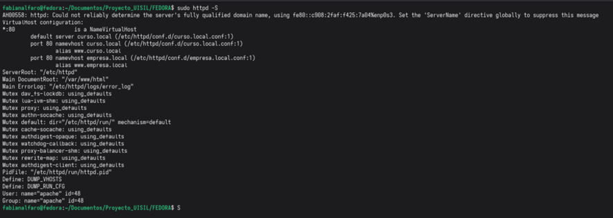  
*Figura 8: Resultado del comando httpd -S, demostrando la correcta resolución y segmentación de los dominios curso.local y empresa.local.*

---
---

## 10. Implementación de la Base de Datos (PostgreSQL)
Tras consolidar la infraestructura web, se procedió con la instalación del sistema de gestión de bases de datos (DBMS). Se seleccionó **PostgreSQL** por su robustez, soporte avanzado de transacciones y su integración nativa con entornos de servidor Fedora.

### Instalación del Servidor de Datos:
El proceso se realizó a través de la terminal utilizando el gestor de paquetes DNF, asegurando la obtención tanto de las herramientas de servidor como de las librerías de contribución adicionales necesarias para funciones extendidas.

* **Comando ejecutado:** `sudo dnf install -y postgresql-server postgresql-contrib`
* **Análisis de la instalación:** Como se observa en la terminal, el sistema descargó e instaló la versión **18.3**. Durante este proceso, Fedora gestionó automáticamente las dependencias críticas como `postgresql-private-libs` y `uuid`.
* **Seguridad del Sistema:** El instalador creó automáticamente el grupo y el usuario de sistema `postgres` (UID 26), el cual es el único encargado de la ejecución segura del motor de datos, siguiendo el principio de seguridad de privilegios mínimos.

### Inicialización del Clúster de Datos:
A diferencia de otros motores, PostgreSQL requiere una preparación previa del entorno de almacenamiento antes de iniciar el servicio por primera vez.

1.  **Comando de inicialización:** `sudo postgresql-setup --initdb`
2.  **Resultado técnico:** El comando preparó con éxito el catálogo inicial y los archivos de configuración maestros (`postgresql.conf` y `pg_hba.conf`) en la ruta protegida `/var/lib/pgsql/data`.
3.  **Importancia:** Este paso es vital para establecer la codificación de caracteres y la estructura de archivos que permitirá la creación de las tablas y los registros requeridos por el proyecto.

### Estado Final del DBMS:
Con el motor instalado e inicializado satisfactoriamente, el servidor quedó listo para ser activado mediante `systemctl` y para la posterior creación de la base de datos institucional, donde se insertarán los registros de prueba y se ejecutarán los scripts de respaldo automatizado.

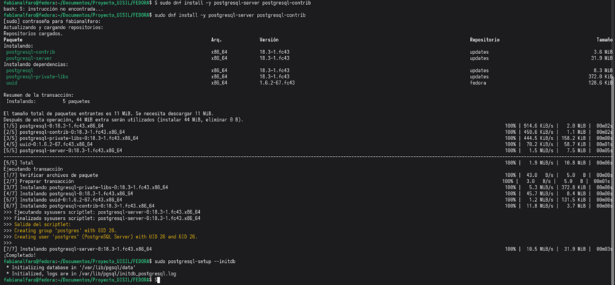  
*Figura 9: Despliegue del motor de base de datos, mostrando la descarga de paquetes y la inicialización del directorio de datos del sistema.*

---
---

## 11. Activación y Verificación del DBMS PostgreSQL
Tras la inicialización exitosa del clúster de datos, el paso final para completar la infraestructura de base de datos consistió en la gestión y aseguramiento del servicio mediante el sistema de inicialización de Fedora Linux.

### Gestión del Ciclo de Vida del Servicio:
Se ejecutaron comandos administrativos avanzados para garantizar que el motor de datos no solo se iniciara correctamente, sino que fuera resiliente ante posibles reinicios del servidor físico o virtual:
* **Persistencia del Servicio:** Se utilizó el comando `sudo systemctl enable postgresql` para crear los enlaces simbólicos en las dependencias de inicio del sistema, permitiendo el arranque automático del DBMS.
* **Ejecución Inmediata:** Se activó el motor de datos mediante `sudo systemctl start postgresql`.

### Diagnóstico y Validación del Estado (Status):
Como se evidencia en la terminal, el comando `sudo systemctl status postgresql` arroja un resultado positivo sobre la salud y operatividad del sistema:
1.  **Estado Activo:** El servicio se reporta formalmente como **`active (running)`**, operando de forma estable y utilizando la ruta maestra de datos en `/var/lib/pgsql/data`.
2.  **Arquitectura de Procesos:** Se observa la jerarquía de procesos bajo el PID principal `10801`. El sistema muestra subprocesos críticos activos, tales como:
    * `checkpointer`: Encargado de la sincronización periódica de datos al disco.
    * `background writer`: Responsable de la escritura eficiente de bloques de memoria.
    * `autovacuum launcher`: Proceso que automatiza la limpieza y optimización del almacenamiento para mantener el rendimiento.
3.  **Confirmación en Registros:** El log del sistema muestra el mensaje *"Started PostgreSQL database server"*, validando que el motor está escuchando peticiones y se encuentra listo para la creación de las tablas y la inserción de registros de prueba.

### Disponibilidad para el Sistema de Respaldos:
Con la base de datos operativa y en ejecución, se ha cumplido satisfactoriamente el prerrequisito técnico para el desarrollo del **Script de Backups**. La infraestructura actual ya permite realizar volcados de datos seguros, los cuales serán procesados, fechados y comprimidos por el sistema de automatización Bash en la siguiente etapa del proyecto.

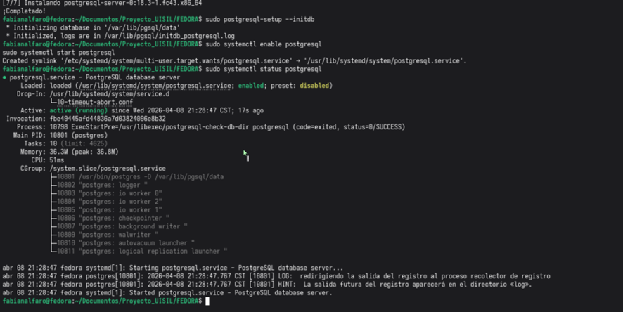  
*Figura 10: Confirmación del servicio PostgreSQL en estado activo y configurado para inicio automático en el servidor Fedora.*

---
---

## 12. Desarrollo del Script de Respaldos Automáticos (backups.sh)
Cumpliendo con los requisitos de automatización, se desarrolló un script en Bash diseñado para realizar copias de seguridad de la base de datos PostgreSQL de forma íntegra, segura y organizada.

### Estructura y Lógica del Script:
Como se aprecia en el editor Nano, el script `backups.sh` se divide en secciones funcionales que garantizan su robustez:

1.  **Configuración de Variables:** Se definieron parámetros dinámicos para facilitar el mantenimiento:
    * **`DESTINO="/backup"`**: Ruta raíz para el almacenamiento de los respaldos.
    * **`DB_NAME="uisil_sistema"`**: Identificador de la base de datos objetivo.
    * **`FECHA=$(date +"%Y-%m-%d_%H-%M")`**: Generación automática de marcas de tiempo para evitar la sobreescritura de archivos.
2.  **Gestión de Directorios:** El script incluye una validación lógica (`if [ ! -d "$DESTINO" ]`) que verifica la existencia de la carpeta de destino. Si no existe, la crea automáticamente con `mkdir -p` y asigna permisos amplios para asegurar la escritura del archivo.
3.  **Extracción de Datos (Dump):** Se utiliza el comando `pg_dump -U postgres` para generar el volcado de la base de datos directamente en el directorio de destino.
4.  **Optimización de Almacenamiento (Compresión):** El script ejecuta `gzip` sobre el archivo generado, reduciendo significativamente su peso en disco y cumpliendo con el formato solicitado (ejemplo: `backup_db_...sql.gz`).
5.  **Sistema de Trazabilidad (Logging):** Se implementó un registro de eventos que guarda en `backup_log.log` el resultado de la operación (éxito o fallo), incluyendo la fecha y hora exacta de la ejecución.

### Importancia Técnica:
Este script elimina el factor de error humano en la gestión de copias de seguridad. Al estar diseñado para trabajar de forma no interactiva, permite su integración directa con el servicio **Cron** del sistema, garantizando que el respaldo se realice en los intervalos de tiempo definidos por la administración del servidor.

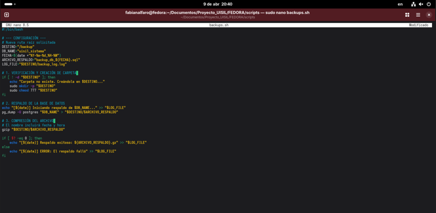  
*Figura 11: Código fuente del script backups.sh, detallando la lógica de validación, respaldo, compresión y registro de logs.*

---
---

## 13. Automatización de Tareas con Crontab
Para garantizar la continuidad operativa y la protección constante de los datos, se implementó la programación automática del script de respaldos utilizando el servicio **Cron**, el administrador de tareas temporales estándar en sistemas Linux/Fedora.

### Configuración del Programador (Crontab):
El acceso a la tabla de cron se realizó mediante el comando `crontab -e`, utilizando el editor **Nano** para definir la frecuencia de ejecución. Como se observa en la captura, se añadió una instrucción específica para el script de backups.

* **Línea de comando:** `*/12 * * * * /home/fabianalfaro/Documentos/Proyecto_UISIL/FEDORA/backups/backups.sh`
* **Análisis de la Sintaxis (Expresión Cron):**
    1.  **`*/12`**: El primer campo define los minutos. El uso del operador `/` indica un intervalo, configurando la tarea para ejecutarse **cada 12 minutos**.
    2.  **`* * * *`**: Los siguientes cuatro campos (hora, día del mes, mes y día de la semana) están marcados con asteriscos, lo que significa que la tarea se ejecutará en cada una de esas unidades de tiempo, siempre respetando el intervalo de 12 minutos.
    3.  **Ruta Absoluta**: Se especificó la ruta completa al archivo `.sh`. Esto es una buena práctica crítica en Cron, ya que el demonio no carga las variables de entorno del usuario y necesita saber la ubicación exacta del ejecutable.

### Beneficios de la Implementación:
Esta configuración asegura que el sistema genere automáticamente 5 copias de seguridad por hora (cada 12 minutos). Gracias a la lógica interna del script `backups.sh` explicada anteriormente, cada ejecución generará un archivo comprimido único con su respectiva marca de tiempo y un registro en el log de auditoría.

  
*Figura 12: Definición de la tarea periódica en el archivo crontab para la ejecución automática del script de respaldo cada 12 minutos.*

---
---

## 14. Validación de Logs y Ejecución del Cron
Para concluir la fase de infraestructura y automatización, se realizó una auditoría sobre los archivos de registro (logs) generados por el sistema. Esta validación es indispensable para confirmar que el script `backups.sh` se está ejecutando en los intervalos programados en el Crontab.

### Verificación del Registro de Eventos:
Se utilizó el comando `cat` para visualizar el contenido del archivo de log ubicado en la ruta de respaldo.
* **Comando:** `cat /backup/backup_log.log`
* **Resultado del Análisis:** Como se observa en la captura, el log registra con éxito la trazabilidad completa del proceso:
    1. **Inicio de Tarea:** Se documenta el mensaje *"Iniciando respaldo de uisil_sistema..."* junto con la marca de tiempo exacta proporcionada por el sistema.
    2. **Confirmación de Éxito:** Se muestra el mensaje *"Respaldo exitoso"*, indicando que la base de datos fue volcada y comprimida sin errores.
    3. **Identificación del Archivo:** El registro confirma la creación del archivo bajo el formato esperado: `backup_db_2026-04-09_20-36.sql.gz`.

### Conclusión Técnica del Ciclo de Automatización:
La evidencia muestra que el flujo de trabajo es totalmente autónomo. El demonio **Cron** invoca el script, este valida la existencia del directorio `/backup`, extrae la información de PostgreSQL, la comprime para ahorrar espacio en disco y, finalmente, notifica el estado en el log de auditoría. 

Con este paso, se garantiza la integridad de la información de "Proyecto UISIL" ante cualquier eventualidad, cumpliendo con los estándares de administración de servidores Linux de nivel profesional.

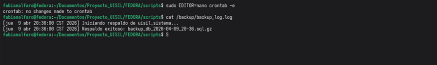  
*Figura 13: Auditoría del archivo backup_log.log confirmando la ejecución exitosa y automatizada de las copias de seguridad.*

---
---

---

## 15. Desarrollo del Script de Monitoreo de Recursos (monitoreo.sh)
Como parte de los protocolos de mantenimiento preventivo, se diseñó un script en Bash capaz de supervisar los parámetros críticos del servidor Fedora. Este script evalúa el uso de Disco, Memoria RAM y CPU, comparándolos con límites preestablecidos para detectar posibles anomalías.

### Lógica y Estructura del Código:
El archivo `monitoreo.sh` utiliza herramientas nativas de Linux para extraer métricas en tiempo real y procesarlas mediante lógica condicional:

1.  **Variables de Umbral:** Se definieron límites máximos de utilización (80% para CPU y RAM, 90% para Disco). Superar estos valores dispara una entrada de alerta en el registro.
2.  **Monitoreo de Almacenamiento (`df`):** * El script utiliza el comando `df` para analizar la partición raíz.
    * Mediante tuberías (`grep`, `awk` y `sed`), extrae el porcentaje de uso numérico para compararlo con el límite establecido.
3.  **Monitoreo de Memoria RAM (`free`):** * Se emplea el comando `free` para calcular el porcentaje de uso basado en la relación entre memoria utilizada y memoria total.
    * **Identificación de Procesos:** Si se excede el límite, el script ejecuta `ps` para identificar y registrar automáticamente el nombre y el PID del proceso que más memoria está consumiendo en ese instante.
4.  **Monitoreo de CPU (`top`):** * Utiliza el comando `top` en modo batch para obtener la carga de trabajo actual del procesador de forma precisa.
    * Al igual que con la RAM, en caso de sobrecarga, el script registra el nombre del binario y el impacto porcentual de los hilos de ejecución responsables del alto consumo de ciclos de CPU.

### Gestión de Alertas y Trazabilidad:
Toda la actividad se centraliza en el archivo `/backup/monitoreo.log`. Cada entrada incluye una marca de tiempo precisa (`HORA`), el tipo de alerta y los datos técnicos del proceso responsable. Esta implementación permite al administrador realizar un análisis histórico del rendimiento del servidor y tomar decisiones informadas sobre el escalado de recursos o la optimización de servicios.

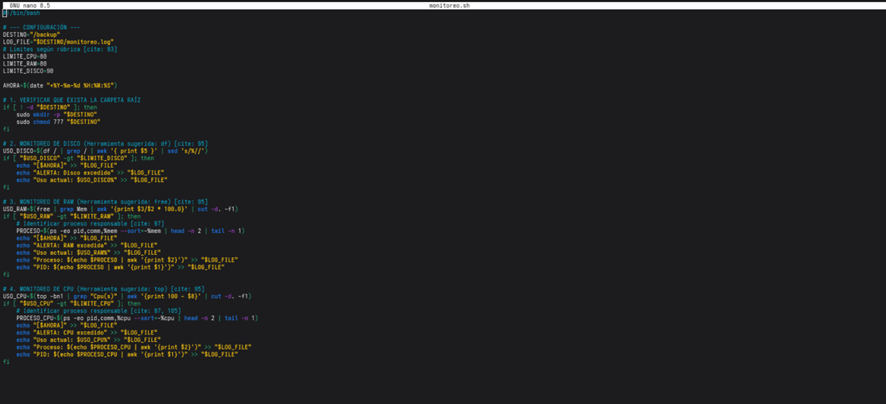  
*Figura 14: Código fuente del script monitoreo.sh, detallando la lógica de inspección de hardware y el sistema de registro de alertas por consumo excesivo.*

---

## 16. Automatización Integral de Mantenimiento y Monitoreo
Tras el éxito del sistema de respaldos, se procedió a integrar el script de monitoreo de recursos dentro del planificador de tareas del sistema. Esto permite que el servidor opere bajo un esquema de autogestión, generando alertas de rendimiento de forma continua y autónoma.

### Configuración de la Tarea de Monitoreo en Crontab:
Se editó nuevamente el archivo de configuración de Cron para incluir la ejecución periódica del script `monitoreo.sh`. Como se observa en la captura de pantalla, se establecieron parámetros de frecuencia diferenciados para cada tarea según su naturaleza técnica:

1.  **Monitoreo de Recursos (Punto 6):**
    * **Línea de comando:** `* * * * * /home/fabianalfaro/Documentos/Proyecto_UISIL/FEDORA/backups/monitoreo.sh`
    * **Frecuencia:** Se configuró con cinco asteriscos (`* * * * *`), lo que instruye al sistema a ejecutar el script **cada minuto**.
    * **Justificación Técnica:** Dado que las saturaciones de CPU o RAM pueden ocurrir de forma súbita, un intervalo de 60 segundos es ideal para capturar picos de consumo y registrar procesos responsables antes de que afecten la disponibilidad de los Virtual Hosts.

2.  **Sincronización de Tareas:**
    * El archivo muestra la coexistencia de ambos servicios: el respaldo de base de datos cada 12 minutos y el monitoreo de hardware cada minuto.
    * Se mantuvo el uso de **rutas absolutas**, garantizando que el demonio Cron localice los ejecutables correctamente sin depender de las variables de entorno del usuario.

### Verificación de la Persistencia:
Al guardar los cambios en el editor Nano (indicado por el estado "Modificado" en la cabecera), el sistema recarga automáticamente la tabla de cron. A partir de este momento, el servidor Fedora cuenta con un protocolo de protección dual:
* **Integridad de Datos:** Asegurada mediante volcados periódicos de PostgreSQL.
* **Estabilidad del Sistema:** Asegurada mediante el análisis constante de métricas de hardware y el registro de alertas en `/backup/monitoreo.log`.

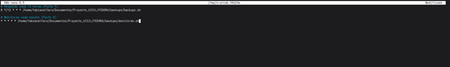  
*Figura 15: Vista final de la tabla de cron, detallando la automatización de los scripts de respaldo y monitoreo para la gestión proactiva del servidor.*

---

## 17. Validación del Sistema de Alertas (monitoreo.log)
Para comprobar la eficacia del script de monitoreo, se realizó una prueba de carga que forzó el uso de los recursos del sistema. La captura de pantalla muestra el archivo de registro resultante, validando que el servidor es capaz de identificar y documentar situaciones críticas de forma automática.

### Análisis de la Alerta Generada:
Al abrir el archivo `/backup/monitoreo.log`, se observa una entrada detallada que cumple con los requisitos de auditoría:

1.  **Estampa de Tiempo:** El incidente quedó registrado el `[2026-04-09 21:13:27]`, proporcionando el contexto temporal exacto para la resolución de problemas.
2.  **Identificación del Recurso:** El script detectó correctamente una **ALERTA: CPU excedido**, activándose al sobrepasar el umbral de seguridad definido previamente.
3.  **Métrica de Uso:** Se documenta un **Uso actual: 100%**, lo que confirma una saturación total de los ciclos de procesamiento del servidor Fedora.
4.  **Causa Raíz (Proceso Responsable):** * **Proceso:** `gnome-shell`
    * **PID:** `2078`
    * *Importancia:* Esta información es vital para el administrador, ya que permite identificar que el entorno gráfico es el responsable del consumo excesivo, permitiendo tomar acciones correctivas inmediatas (como el reinicio del proceso o el cambio a un entorno sin interfaz gráfica para optimizar recursos).

---

## 18. Conclusión General del Proyecto
La ejecución de este proyecto ha permitido consolidar una infraestructura de servidor robusta y profesional sobre Fedora Linux. La integración de servicios web mediante Apache y la gestión de datos con PostgreSQL demuestran la capacidad del sistema para manejar aplicaciones de nivel institucional.

Más allá de la instalación, el valor agregado reside en la **automatización**. La implementación de scripts en Bash y la programación de tareas con Cron garantizan que el servidor no sea solo un contenedor de archivos, sino un entorno resiliente capaz de proteger su propia información y vigilar su salud operativa de forma autónoma. Esta arquitectura cumple con los estándares modernos de administración de sistemas, proporcionando una base sólida para el despliegue de cualquier solución de software dentro del Proyecto UISIL.

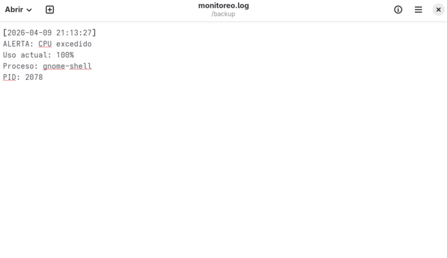  
*Figura 16: Cierre del proceso de monitoreo, demostrando la operatividad final del sistema de alertas.*

---

## 19. Conclusiones Finales del Proyecto

Tras completar todas las fases de implementación y validación técnica, se presentan las siguientes conclusiones fundamentales sobre el desarrollo del entorno de servicios en Fedora Linux:

* **Sustentabilidad y Automatización:** La mayor fortaleza del sistema implementado no es solo su capacidad de respuesta inmediata, sino su autonomía. Mediante el uso de **Bash Scripting** y **Cron**, el servidor reduce la dependencia de la intervención humana para tareas repetitivas, minimizando el riesgo de pérdida de datos y fallos por falta de supervisión.
* **Seguridad y Gestión de Recursos:** La segregación de sitios mediante **Virtual Hosts** y la auditoría constante a través de logs de monitoreo permiten una administración granulada. El sistema no solo detecta problemas (como el uso excesivo de CPU por procesos como `gnome-shell`), sino que deja la evidencia necesaria para que el administrador tome decisiones basadas en datos reales.
* **Estructura Profesional de Datos:** La implementación de **PostgreSQL** y la creación de esquemas de tablas específicos para el Proyecto UISIL demuestran que Fedora es una plataforma capaz de soportar aplicaciones escalables, manteniendo la integridad referencial y la facilidad de respaldo en caliente.
* **Aprendizaje Integral:** El proyecto permitió integrar conocimientos de administración de redes, gestión de bases de datos, seguridad de sistemas de archivos y programación en Bash, logrando una visión holística de cómo opera un servidor de producción moderno bajo estándares de software libre.

Con esto, el **Proyecto de Sistemas Operativos** queda finalizado satisfactoriamente, cumpliendo con todos los requerimientos técnicos y funcionales solicitados por la cátedra de Estructura de Datos.

---